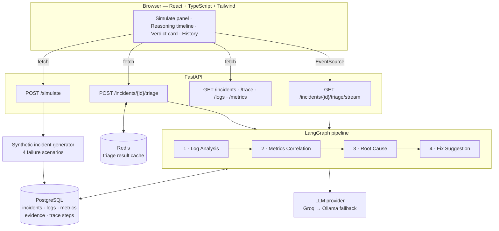

# Architecture

How Incident Sentinel is put together, and why the pieces are shaped the way
they are.

---

## 1. The problem

An on-call engineer facing a production incident does roughly four things:
reads the error logs, checks whether the metrics agree, decides which service
actually broke, and works out what to do about it. Each step feeds the next,
and the hard part is not any single step — it is keeping the chain of
reasoning honest, so the eventual verdict can be traced back to the evidence
that produced it.

Incident Sentinel models that chain as four cooperating agents and then makes
the chain itself the product. The UI does not hand you a verdict; it shows you
the reasoning arriving one agent at a time, with every claim cited.

---

## 2. System overview



Three processes in development: the FastAPI app, PostgreSQL, and Redis. The
frontend is a Vite dev server that proxies `/api` to the backend, so the
browser sees a single origin and SSE needs no CORS handling.

---

## 3. The synthetic data layer

There is no real infrastructure behind this. `app/simulator/` generates
incidents that are internally consistent enough for diagnosis to be a genuine
inference problem.

**Five services** with a topology the agents are told about:

```
api-gateway ──▶ auth-service
            ──▶ payments-service ──▶ orders-db
            ──▶ notification-worker
```

Each service has a `ServiceProfile` giving baseline values for five metrics —
`latency_p95_ms`, `error_rate`, `cpu_pct`, `memory_mb`, `conn_pool_used_pct` —
which are then wobbled per tick to look like real telemetry.

**Four scenarios**, each with a deliberately distinct signature:

| Scenario | Origin | Signature |
| --- | --- | --- |
| `bad_deploy` | payments-service | Error rate steps up sharply seconds after a deploy marker; resources stay flat |
| `memory_leak` | notification-worker | Memory climbs monotonically for minutes, then an `OOMKilled` event |
| `slow_query` | orders-db | Latency rises first and propagates upward; error rate follows late |
| `conn_pool_exhaustion` | auth-service | Pool utilisation saturates, then the gateway degrades *after* auth does |

The distinctness matters. If two scenarios looked alike in the data, a correct
diagnosis would be a coin flip rather than evidence of reasoning.

The critical invariant: **logs and metrics tell the same story.** Error-log
volume is driven by the generated `error_rate` metric, so an agent that reads
only logs and an agent that reads only metrics will independently arrive at
compatible conclusions. Cascade timing is tuned so effects genuinely follow
causes — in `conn_pool_exhaustion`, the gateway's error ramp starts at +150s
while auth's starts at +60s, so an agent that reasons from onset ordering
reaches the right origin.

Generation is seeded, so `(scenario, seed, window)` reproduces an incident
exactly. The database rows get fresh UUIDs on insert, so the same incident can
be simulated repeatedly without primary-key collisions.

**Ground truth** is stored on the incident row and **never served by the
API.** It exists to score the agents in tests, not to help them at runtime.

---

## 4. The agent pipeline

`app/agents/orchestrator.py` builds a LangGraph `StateGraph` over a
`TriageState` TypedDict. The graph is strictly sequential:

```
START → log_analysis → metrics_correlation → root_cause → fix_suggestion → END
```

Each node runs one agent, merges its output into the shared state, persists the
step, and fires an `on_step` callback. That callback is what the SSE endpoint
hangs off — the stream is a consequence of the orchestrator's design rather
than a parallel code path.

### The hybrid pattern

Every agent is **deterministic extraction + LLM narration**, never LLM-only:

- A pure Python function does the measurable work — clustering errors by
  `(service, error_type)`, computing onset offsets, finding baseline-to-peak
  ratios, ranking anomalies by how early and how far they deviate.
- The LLM then explains, ranks, or narrates what that function found.

This split is the core design decision. It means numbers in the UI are
computed, not generated — an LLM never invents a latency figure — while the
narrative that makes the trace readable is still natural language. It also
degrades gracefully: when the LLM is unavailable, the deterministic layer still
produces a usable (if terse) answer.

### The four agents

**1 · Log Analysis** clusters error logs by service and error type, records
each cluster's onset offset relative to incident start, and surfaces lifecycle
markers (deploy events, `OOMKilled`, restarts). The LLM summarises which
clusters matter and why.

**2 · Metrics Correlation** finds anomalies — baseline, peak, ratio, onset —
and ranks them by onset order. It also reports `notable_stable()`: metrics that
stayed *normal*. These rule-out signals are what let the root-cause agent say
"api-gateway's CPU never moved, so it is not the origin," and they are the
difference between a diagnosis and a guess.

**3 · Root Cause** receives both upstream digests plus the service topology and
returns a ranked list of candidates with confidences. It is deliberately given
**observations only — never a catalogue of known failure modes** — so a correct
answer is inference rather than lookup.

Everything it returns is validated: confidences clamped to `[0, 1]`, service
names checked against the real topology, and invented citations dropped. If no
candidate survives validation, the agent falls back to onset ordering at
confidence 0.35 and logs why — a silent downgrade would be indistinguishable
from a confident diagnosis in the stored trace.

**4 · Fix Suggestion** proposes ordered remediation steps, each tagged `mitigate`
or `fix`, each with a rationale and a risk. Mitigations come before permanent
fixes, because that is the order an on-call engineer actually needs them.

### Evidence and citations

`EvidenceBook` is the mechanism that keeps the chain honest.

Agents cite evidence by **short tokens** — `L1`, `L2` for logs, `M1`, `M2` for
metrics — rather than by UUID. Two reasons: tokens cost a fraction of the
prompt budget that UUIDs would, and a model cannot plausibly hallucinate a
valid-looking UUID that happens to exist.

On the way back, `book.resolve()` maps tokens to the stored `incident_evidence`
rows and **silently drops anything that does not resolve.** A hallucinated
citation cannot reach the UI. The persisted `agent_trace_steps.evidence_refs`
holds real row UUIDs, so every claim in the trace links to the log line or
metric point behind it.

---

## 5. Data model

Five tables, all keyed by incident:

| Table | Holds |
| --- | --- |
| `incidents` | Scenario, seed, window, status, final root cause + confidence, ground truth (never served) |
| `incident_logs` | Generated log lines — timestamp, service, level, message, `trace_id`, JSONB `attrs` |
| `incident_metrics` | Metric points — timestamp, service, metric name, value |
| `incident_evidence` | The specific rows an agent cited, with `source IN ('log','metric')` and a `source_ref` back to the original |
| `agent_trace_steps` | One row per agent: summaries, reasoning, `evidence_refs UUID[]`, duration |

Logs and metrics are written with chunked `executemany` — a 30-minute window is
roughly 5,700 log rows and 3,000 metric points, and row-by-row inserts would
dominate the request.

Schema creation is plain `Base.metadata.create_all` (via
`python -m app.db.session --init`, also run on app startup). Alembic is in
`requirements.txt` for when this stops being a demo, but a migration chain
would be ceremony here.

---

## 6. LLM layer

`app/llm/client.py` presents one `LLMClient` interface over three backends:

| Client | Model | Role |
| --- | --- | --- |
| `GroqClient` | `openai/gpt-oss-120b` | Primary — fast and free-tier |
| `OllamaClient` | `llama3.2:3b` | Local fallback, no API key, no network |
| `StubLLMClient` | — | Canned responses, keyed by longest match, for tests |

> The spec named Llama 3.1/3.3 on Groq; those have since been retired by the
> provider, so the model id moved to `openai/gpt-oss-120b`. Everything else
> about the integration is unchanged.

The interesting part is surviving a free tier. Groq's free plan allows **8,000
tokens per minute**, and a full four-agent triage costs roughly 7,000 — so the
pipeline runs permanently close to the ceiling.

- **`TokenBudget`** tracks usage in a sliding window and reserves an estimate
  before each call.
- On a 429, the client **parses the server's own accounting** out of the error
  body — `Used 6720, Requested 1429`, `try again in 1.1175s` — and calls
  `budget.sync()` with the real number rather than trusting its local estimate.
  The server knows better than we do; adopting its numbers beats guessing
  through the backoff.
- Retries are exponential with jitter, four attempts.
- Strict JSON mode occasionally rejects a response it cannot validate, usually
  a truncation at the output cap. The client retries once **without**
  `response_format`, since the local parser is tolerant — better than losing
  the whole call.

`MAX_OUTPUT_TOKENS` is 800: high enough for a full diagnosis with reasoning,
low enough to keep four agents inside one minute's budget.

---

## 7. Caching

Redis caches completed triage results, keyed on
`(incident_id, provider, model)` behind a version prefix. Re-opening an
incident is free; only `refresh` spends four more LLM calls.

`RedisCache` **never raises at the call site.** If Redis is unreachable the
call returns a miss and the pipeline runs normally — a cache outage must not
become an API outage. `InMemoryCache` is the drop-in for tests and for local
runs with no Redis at all.

Note that `refresh` is a field on the POST body, not a query parameter. Only
the SSE `GET` takes it in the query string, because `EventSource` cannot send
a body.

---

## 8. Streaming

`GET /incidents/{id}/triage/stream` returns an `EventSourceResponse` from
`sse-starlette`. It is a `GET` because `EventSource` only issues GETs.

The pipeline is synchronous and CPU/IO-bound in a way that would block the
event loop, so the endpoint runs it on a **worker thread with its own
`SessionLocal`** — a SQLAlchemy session is not safe to share across threads —
and bridges back to async via a `queue.Queue` polled with `anyio.sleep`. The
orchestrator's `on_step` callback pushes each completed agent onto that queue.

The browser therefore sees a step land the moment an agent finishes, which is
the entire point of the UI.

---

## 9. Frontend

Vite + React 18 + TypeScript + Tailwind 3. No component library, no chart
library — the sparklines are inline SVG, a few dozen lines, and pulling in
Recharts to draw a 40-point line would be the larger cost.

Layout is a fixed-width sidebar (simulate panel + history, sticky on large
screens) beside a fluid main column (reasoning timeline + verdict). The sidebar
uses `min-w-0` on its flex children because the default `min-width: auto` lets
long service names force horizontal overflow rather than truncate.

`streamTriage()` wraps `EventSource` and returns a teardown function, so a
component unmount closes the stream rather than leaking it.

---

## 10. Deployment

| Piece | Target | Notes |
| --- | --- | --- |
| Backend | Render Web Service | Docker, `backend/Dockerfile`, binds `$PORT` |
| Database | Render PostgreSQL | Free tier |
| Cache | Upstash Redis | Free tier, TLS (`rediss://`) |
| Frontend | Vercel | Static build, `VITE_API_URL` points at the backend |

In development the frontend proxies `/api` to `127.0.0.1:8000`, so there is one
origin and no CORS. In production the two are on different origins, so the
backend's `CORS_ORIGINS` must name the Vercel domain — this is the single most
common deployment failure.

Render's free tier idles a service after inactivity, so the first request after
a quiet period pays a cold start of roughly 50 seconds. For a live demo, wake
the backend before starting.

---

## 11. Things deliberately not done

- **No migration chain.** `create_all` for a demo; Alembic is present for when
  that stops being true.
- **No auth.** There is nothing to protect and no multi-tenancy.
- **No background queue.** Triage is ~20 seconds, which SSE handles honestly.
  Celery would be architecture for its own sake.
- **No vector store / RAG.** The agents reason over the incident in front of
  them. Retrieval over historical incidents is the obvious next feature, not a
  missing piece of this one.
- **No real telemetry ingestion.** The generator is the point: reproducible,
  seeded incidents with known ground truth make the agents measurable.
